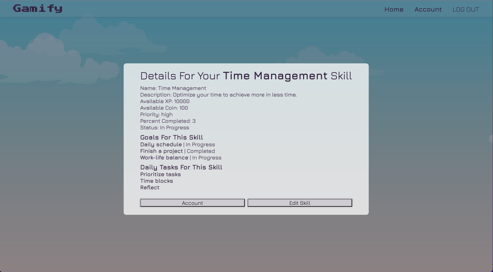

# Gameify
Embark on a grand quest for self-improvement with Gameify, your enchanted gateway to turning mundane tasks into epic adventures. In this whimsical RPG realm, your goals, skills, and daily tasks take on a magical charm, transforming into quests and challenges waiting to be conquered. Dive into the fantastical world of the in-game shop, where coins are the currency of dreams, unlocking treasures, and leveling up your character with every achievement. With Gameify, your life story becomes a captivating saga filled with achievements, rewards, and the joy of leveling up in the grand RPG of reality.

<p align="center">

<p>

## Tech Stack
- MongoDB
- Express.js
- Node.js
- Javascript
- HTML
- CSS

## Getting Started 
Welcome to Gameify, your personal RPG for turning daily tasks, goals, and skills into an epic adventure! Follow these simple steps to embark on your quest for self-improvement.

### Prerequisites
Before you start, make sure you have the following:

- **Node.js:** Gameify is built on Node.js. If you don't have it installed, you can download it [here](https://nodejs.org/en).
- **MongoDB:** Gameify uses MongoDB to sotre your magical journey. You can install MongoDB by following the instructions [here](hhttps://www.mongodb.com/docs/manual/installation/).

### Installation
1. **Clone the respository:**
```bash
git clone https://github.com/MelanieWinter/gameify.git
```
2. **Navigate to the project folder:**
```bash
cd gameify
```
3. **Install dependencies:**
```bash
npm install
```
4. **Set up environmental variables:**
- Create a `.env` file in the root directory.
- Add your MongobD connection URI:
```env
DATABASE_URL=your_mongodb_connection_uri
```
5. **Run the application using `nodemon`:**
```bash
npm start
```

## Usage
**Visit http://localhost:3000 in your browser**
- The magic begins here! Explore the user interface, add your skills, set goals, and conquer tasks.

**Choose an Avatar:**
- Navigate to the mystical cogwheel beneath your name to choose an avatar that resonates with you. 
- Dive into a collection of 50 enchanting images and pick the one that best represents your epic journey in the realm of Gameify!

**Daily Tasks:**
- Your daily tasks reset daily. Add them once, conquer them daily to receive xp and coins!

**Skills' Completion Meter**
- As you conquer daily tasks and goals linked to a skill, witness the skillls' completion meter soar. The more milestones you achieve, the closer you get to mastering that skill!
- Experience a grand surge of xp and coins upon reaching the pinnacle of a skill's mastery!

**Ascend the Levels**
- Ascend the levels by accumulating xp.
- With every 50,000xp, elevate yourself to a new level, unlocking fresh realms of achievement and expertise.

**Visit the Shop:**
- Click on the "Go To The Shop" button to explore the in-game shop.
- Use your hard-earned coins to purchase exciting items and get cool gear for your character.

**Contributing:**

Contributions to make Gameify even more enchanting are always welcome. [Contibution Guidlines](#), soon to come.

Now, you're all set to embark on your Gameify journey! May your tasks be conquered, and your character level up in the grand RPG of reality! 🏰👑

## Screenshots

<p align="center">




<p>

## Next Steps
1. Running 'push' notifications to pop up to alert the user of achievements (i.e., leveling up, gaining xp, gaining coins).
2. The ability to delete items from the inventory.
3. A community feature to create groups and compete in 'quests' and 'challenges' with other groups in task, goal, and skill achievements.
4. User badges: If you compete in quests and challenges the user will gain badges to display on their public profile.
5. Have a 'steak' notification on your daily tasks, that shows how many days in a row the user has completed that specific task.
6. Make the app mobile friendly and responsive.
